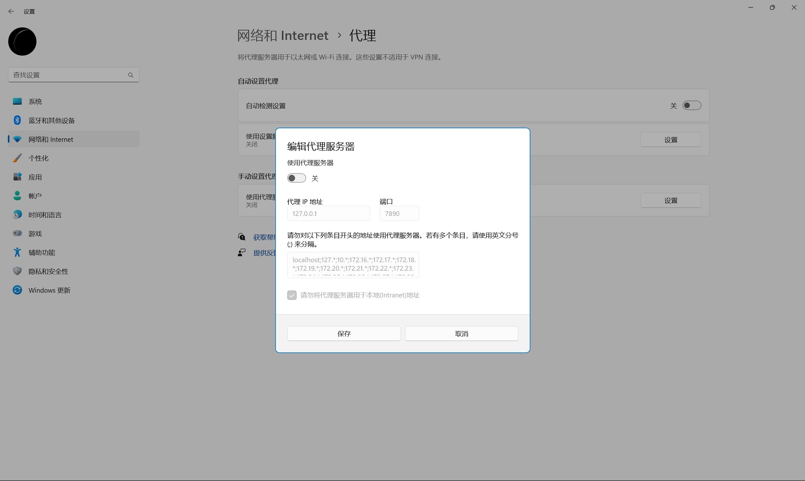
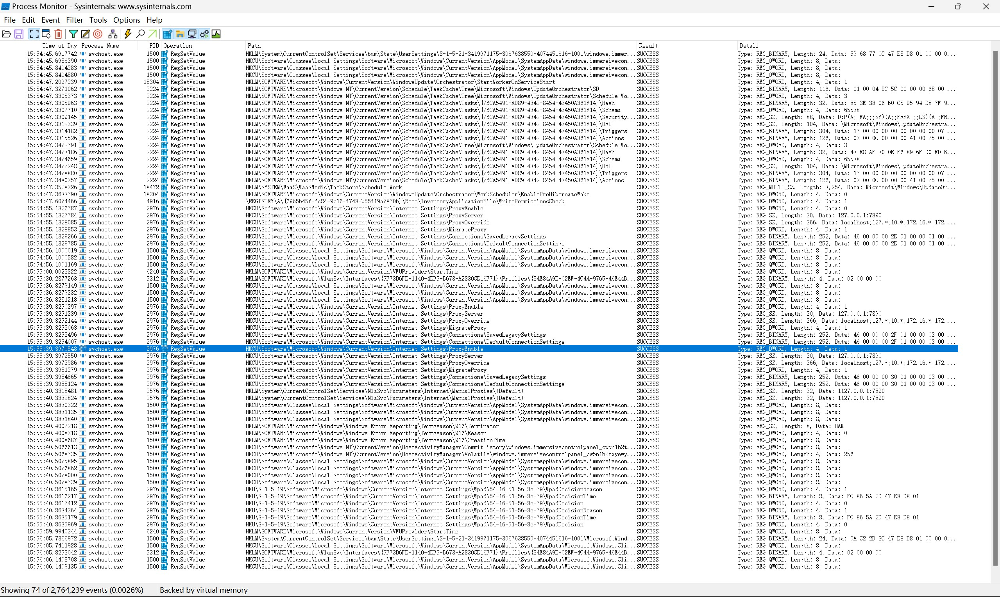
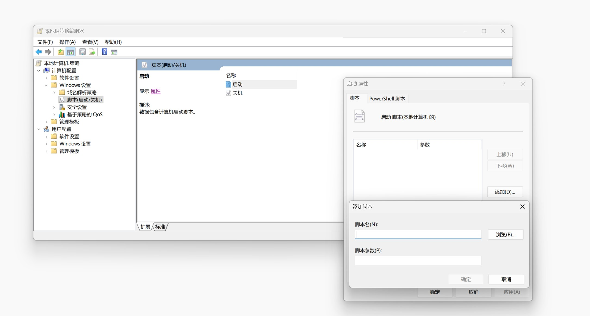

# Clash_Proxy_AutoDisable

[- 遇到的问题](#遇到的问题)

[- 解决方案](#解决方案)

[- 流程自动化](#流程自动化)


## 遇到的问题

​	在使用***Clash for Windows***时，当关机前没有Quit掉程序时，都必须要手动到“代理——网络和Internet——代理——手动设置代理”中关闭使用代理服务器并保存。这一系列操作非常麻烦。



​	这个问题出现的次数不少，可见https://github.com/Fndroid/clash_for_windows_pkg/issues/312


## 解决方案

​	在 [clash_for_windows_pkg](https://github.com/Fndroid/clash_for_windows_pkg) 的 repo 内的 [#312](https://github.com/Fndroid/clash_for_windows_pkg/issues/312)，Fndroid给出了一个思路：利用Process Monitor观察注册表键值的修改情况。



​	可以找到代理设置开关对应的键值就是：(0x0为关闭Proxy，0x1为开启Proxy)

```
HKCU\Software\Microsoft\Windows\CurrentVersion\Internet Settings\ProxyEnable
```

​	再利用注册表修改命令：

```powershell
reg add "HKCU\Software\Microsoft\Windows\CurrentVersion\Internet Settings" /v ProxyEnable /d 0 /t REG_DWORD /f 
```


## 流程自动化

### 	Win10/11 Home Edition

​	对于家庭版，由于没有gpedit.msc（且即使强制激活gpedit后也无法正常使用脚本功能），因此调用exe是最方便的方法。

​	在[ProxyDisable.py](https://github.com/Sicheng-Wei/Clash_Proxy_AutoDisable/blob/main/ProxyDisable.py)中，是一个简单的Python命令行小程序。可用pyinstaller打包成单个exe文件。

```bash
pyinstaller -F -w ProxyDisable.py
```

​	最后，在运行中输入`shell:startup`，把生成的[ProxyDisable.exe](https://github.com/Sicheng-Wei/Clash_Proxy_AutoDisable/blob/main/Home_Edition/ProxyDisable.exe)放入文件夹即可。

​	效果：开机后0~10秒内自动将设置中的手动代理关闭。


### 	Win10/11 Professional Edition

​	将以下命令写入[ProxyDisable.bat](https://github.com/Sicheng-Wei/Clash_Proxy_AutoDisable/blob/main/Prof_Edition/ProxyDisable.bat)脚本：

```powershell
reg add "HKCU\Software\Microsoft\Windows\CurrentVersion\Internet Settings" /v ProxyEnable /d 0 /t REG_DWORD /f 
```

​	用gpedit.msc的脚本功能即可：


